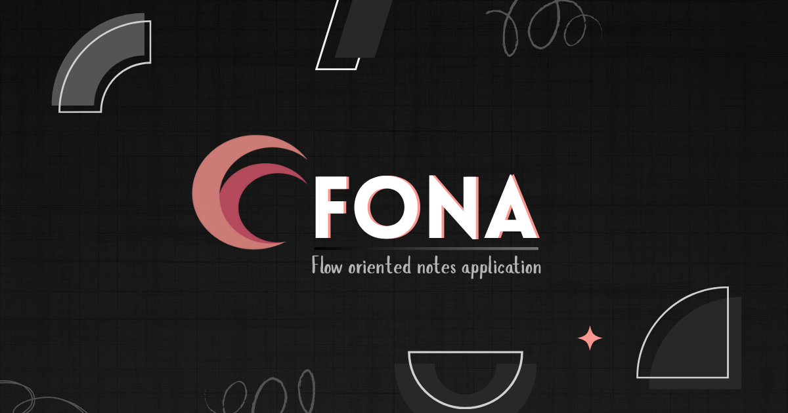

# Fona Extension
A seamless browser extension that captures thoughts, code snippets, and research without breaking your flow - directly from any webpage.


<p align="center">
  <a href="https://chromewebstore.google.com/detail/fona-extension/your-extension-id">
    
  </a>
  <a href="https://addons.mozilla.org/en-US/firefox/addon/fona-extension/">
    
  </a>
</p>



## ✨ Features

- **Flow-Oriented Capture** - Save thoughts and snippets without tab switching or popups
- **Rich Text Support** - Capture formatted content with Editor.js block structure
- **Instant Sync** - Notes automatically sync with your Fona web application
- **Context Preservation** - Maintains source URL and timestamp for reference
- **Distraction-Free** - Minimal interface designed to keep you in your flow state
- **JSON-Powered** - Structured data storage for seamless integration

## 🛠️ **Development**

### **Setup & Run**

Clone the repository and install dependencies:

```bash
git clone https://github.com/useFona/fona-extension.git
cd fona-extension
npm install
```

Start the development server with:

```bash
npm run dev
```

This will build the extension in **watch mode**, so changes automatically reflect when reloaded in the browser.

### **Building for Production**

**Chrome Web Store**
✅ Supported • [Developer Dashboard](https://chrome.google.com/webstore/devconsole) • [Publishing Docs](https://developer.chrome.com/docs/webstore/publish/)

To create a ZIP for Chrome:
```bash
wxt zip
```

**Firefox Addon Store**
✅ Supported • [Developer Dashboard](https://addons.mozilla.org/developers/) • [Publishing Docs](https://extensionworkshop.com/documentation/publish/)

Firefox requires you to upload a ZIP of your source code for review. To create both extension and source ZIPs:
```bash
wxt zip -b firefox
```

**Important for Firefox submissions:**
- Always test your sources ZIP before submitting
- Ensure you have a `README.md` or `SOURCE_CODE_REVIEW.md` with build instructions
- Verify the build output matches between your main project and extracted ZIP

Test your sources with:
```bash
npm install
npm run build:firefox
```

> For more detailed installation and publishing guide visit [WXT Guide](https://wxt.dev/guide/introduction.html)

## 🎯 **How It Works**

Fona Extension integrates seamlessly with your browsing workflow:

1. **Highlight** text on any webpage
2. **Right-click** and select "Save to Fona"
3. **Add context** with a quick note if needed
4. **Continue browsing** - your note is already saved

All captured content is structured in JSON format and syncs with your [Fona web application](https://github.com/useFona/fona-web) for organization and further editing.

## 🔗 **Integration**

This extension works hand-in-hand with the main Fona application:

- **Web App**: [Fona - Flow-Oriented Notes Application](https://github.com/useFona/fona-web)
- **Authentication**: Syncs with your Fona account
- **Data Format**: Compatible JSON structure for seamless editing

## 🤝 **Contributing**

Want to improve **Fona Extension**? Contributions are always welcome!

### **How to Contribute**

1. **Fork** the repository
2. **Create a new branch**: `git checkout -b feature-name`
3. **Make your changes** following our coding standards
4. **Commit & push**: `git commit -m "Added new feature"`
5. **Open a Pull Request** 🎉

### **Guidelines**

- Raise an issue before starting work on major features
- Follow the existing project structure and TypeScript conventions
- Keep PRs focused and include proper descriptions
- Test your changes across different websites

## 🐛 **Found a Bug?**

Create an issue with:
- Clear description of the problem
- Steps to reproduce
- Expected vs actual behavior
- Browser and extension version


## 📝 License

This project is licensed under the MIT License - see the [LICENSE](LICENSE) file for details.

---

<div align="center">
Built with ❤️ for seamless flow-oriented note-taking<br>
Part of the <a href="https://github.com/useFona">Fona</a> ecosystem by <a href="https://github.com/not-meet">Meet Jain</a>
</div>